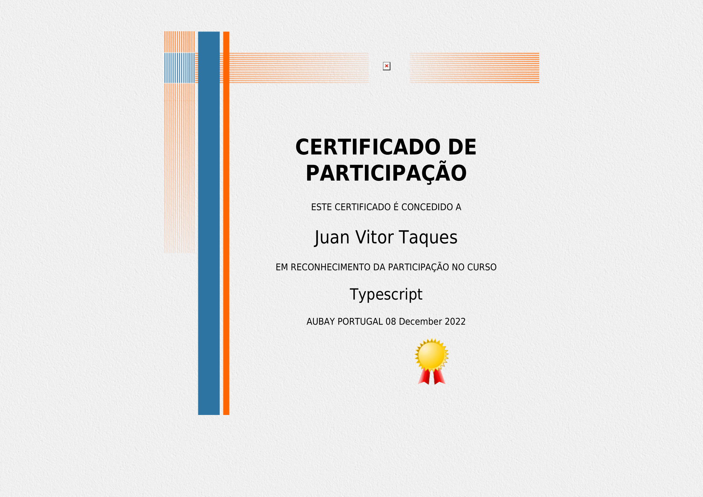

<a name="readme-top"></a>

<!-- PROJECT LOGO -->
<br />
<div align="center">
  <a href="https://github.com/bleckcat/NextJS-Typescript-messager">
    
  </a>

  <h3 align="center">This Project was made to test my TypeScript skills</h3>

  <p align="center">
    And also proving that I have other capabilities
  </p>
  
</div>

<!-- TABLE OF CONTENTS -->
<details>
  <summary>Table of Contents</summary>
  <ol>
    <li>
      <a href="#about-the-project">About The Project</a>
      <ul>
        <li><a href="#built-with">Built With</a></li>
      </ul>
    </li>
    <li>
      <a href="#getting-started">Getting Started</a>
      <ul>
        <li><a href="#installation">Installation</a></li>
      </ul>
    </li>
    <li><a href="#usage">Usage</a></li>
  </ol>
</details>

<!-- ABOUT THE PROJECT -->

## About The Project


This projects aims to develop my skills with multiple new things that I would like to test or already now how to use but I want to use the latest version, a good example in that this projects uses NextJS 13.

Here's why:

- It's a good way to show what I can do and how I do my work.
- I can always use this code later if I need to.
- It's fun to code :D.

It felt good to use SSR for the first, and I always wanted to but didn't had the time.

<p align="right">(<a href="#readme-top">back to top</a>)</p>

### Built With

This section should list any major frameworks/libraries/add-ons/plugins used to bootstrap your project.


<p align="right">(<a href="#readme-top">back to top</a>)</p>

<!-- GETTING STARTED -->

## Getting Started

This is an example of how you may give instructions on setting up your project locally.
To get a local copy up and running follow these simple example steps.

<!-- Installation -->

### Installation

1. Clone the repo
   ```sh
   git clone https://github.com/bleckcat/NextJS-Typescript-messager
   ```
2. Install NPM packages
   ```sh
   npm install
   ```
3. Run the code
   ```sh
   npm run dev
   ```
4. Remember to get all your KEYS from facebook for Devs, Pusher and Redis

<p align="right">(<a href="#readme-top">back to top</a>)</p>
